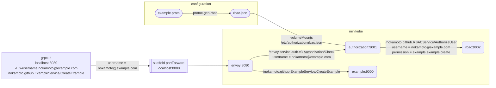
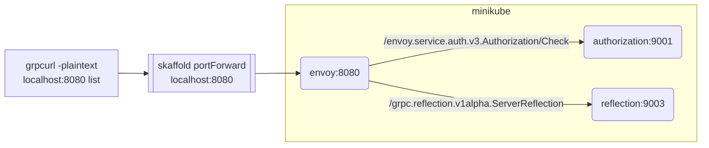

# grpc-cue-envoy-rbac

## Skaffold
```bash
make # create deployments/rbac.json (protoc-gen-rbac)
skaffold dev
```

| service | port |
| --- | --- |
| [envoy](deployments/envoy.yaml) | 8080 |
| [example](deployments/example.yaml) | 9000 |
| [authorization](deployments/authorization.yaml) | 9001 |
| [rbac](deployments/rbac.yaml) | 9002 |
| [reflection](deployments/reflection.yaml) | 9003 |

### /nokamoto.github.ExampleService/CreateExample

```bash
grpcurl -plaintext -H x-username:nokamoto@example.com localhost:8080 nokamoto.github.ExampleService/CreateExample
```

example.proto
```protobuf
service ExampleService {
  rpc CreateExample(CreateExampleRequest) returns (Example) {
    option (nokamoto.github.authz) = {
      permission: "example.example.create"
    };
  }
}
```

rbac.json
```json
{
    "rules":[
        {
            "path":"/nokamoto.github.ExampleService/CreateExample",
            "authorization":{
                "permission":"example.example.create"
            }
        }
    ]
}
```



### /grpc.reflection.v1alpha.ServerReflection

```bash
grpcurl -plaintext localhost:8080 list
```


