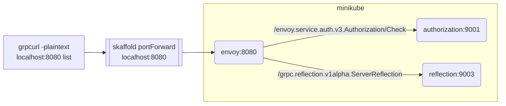

# grpc-cue-envoy-rbac

## Skaffold
```bash
make # create deployments/rbac.json (protoc-gen-rbac)
skaffold dev
```

| service | port |
| --- | --- |
| [envoy](deployments/envoy.yaml) | 8080 |
| [example](deployments/example.yaml) | 9000 |
| [authorization](deployments/authorization.yaml) | 9001 |
| [rbac](deployments/rbac.yaml) | 9002 |
| [reflection](deployments/reflection.yaml) | 9003 |

### /grpc.reflection.v1alpha.ServerReflection

```bash
grpcurl -plaintext localhost:8080 list
```



### todo
```bash
grpcurl -plaintext localhost:9000 list
grpcurl -plaintext localhost:9001 list
grpcurl -plaintext localhost:9002 list
grpcurl -plaintext localhost:9003 list
```
